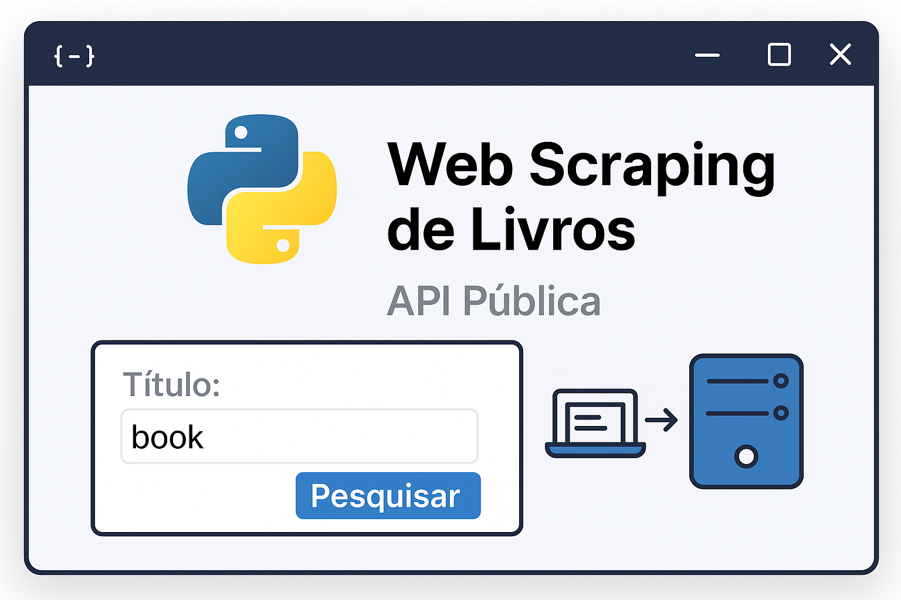

# 6MLET Tech Challenge #1

[](https://github.com/fabricio-entringer/6mlet-tech-challenge-01/actions)
[](https://github.com/fabricio-entringer/6mlet-tech-challenge-01/actions)

<div align="center">
  
</div>

<br/>
Tech Challenge #1 - FIAP Machine Learning Engineering Postgraduate specialization course

## Overview

This project is a FastAPI application created for the 6MLET Tech Challenge - Delivery 01. It includes a simple REST API, comprehensive testing with pytest, and version control using commitizen.

This delivery is from **Group #3**, with the following team members:
- **Fabricio Entringer** 
- **Adriano Ribeiro** - [GitHub Profile](https://github.com/adrianoribeiro)

## Features

- **FastAPI** web framework for building APIs
- **Uvicorn** ASGI server for running the application
- **pytest** for testing with async support
- **Commitizen** for conventional commits and version management
- **Web Scraping System** for automated book data collection from books.toscrape.com
  - CLI and programmatic interfaces
  - Comprehensive data extraction with pagination support
  - Robust error handling and retry mechanisms
  - Rate limiting and respectful crawling
  - CSV export functionality
  - Detailed logging and statistics

## Project Structure

## Project Structure

```text
├── app/
│   ├── __init__.py
│   └── main.py          # FastAPI application
├── scripts/             # Web scraping and utility scripts
│   ├── __init__.py
│   ├── books_scraper.py # Main scraper implementation
│   ├── scraper_api.py   # API interface for CLI and programmatic use
│   ├── run_scraper.py   # CLI interface for scraper
│   ├── config.py        # Scraper configuration
│   └── README.md        # Scraper documentation
├── tests/
│   ├── __init__.py
│   ├── test_main.py     # API test cases
│   ├── test_books_scraper.py # Scraper test cases
│   └── test_scraper_api.py   # Scraper API test cases
├── data/                # Output directory for scraped data (gitignored)
├── logs/                # Log files directory (gitignored)
├── assets/              # Project assets
├── requirements.txt     # Python dependencies
├── pyproject.toml       # Project configuration
├── demo_api_usage.py    # API usage demonstration script
```

## Web Scraping System

The project includes a comprehensive web scraping system for extracting book data from [books.toscrape.com](https://books.toscrape.com/). The system provides both command-line and programmatic interfaces.

### Quick Start

```bash
# Scrape all books (recommended API interface)
python scripts/scraper_api.py

# Get available categories
python scripts/scraper_api.py --mode categories

# Scrape a specific category
python scripts/scraper_api.py --mode category --category "Fiction"

# Scrape a sample of books
python scripts/scraper_api.py --mode sample --max-books 50

# Demonstrate programmatic usage
python demo_api_usage.py
```

### Key Scraper Features

- **Complete Data Extraction**: Scrapes all books with pagination support
- **Multiple Interfaces**: CLI and programmatic API access
- **Comprehensive Data**: Title, price, rating, availability, category, image URL
- **Robust Error Handling**: Retry mechanisms and graceful error recovery
- **Rate Limiting**: Respectful crawling with configurable delays
- **Data Export**: CSV format with organized output
- **Detailed Logging**: Comprehensive logging and statistics
- **Flexible Usage**: Sample scraping, category-specific scraping, full scraping

For detailed documentation, see [`scripts/README.md`](scripts/README.md).

## Installation

1. Create and activate a virtual environment:

   ```bash
   make venv
   source venv/bin/activate
   ```

2. Install dependencies:

   ```bash
   make install
   ```

Alternatively, you can do it manually:

```bash
python3 -m venv venv
source venv/bin/activate
pip install --upgrade pip
pip install -r requirements.txt
```

## Running the Application

1. Start the FastAPI server:

   ```bash
   python run.py
   ```

   Or using make:

   ```bash
   make run
   ```

2. The API will be available at: `http://localhost:8000`
3. Interactive API documentation: `http://localhost:8000/docs`
4. Alternative API documentation: `http://localhost:8000/redoc`

## API Endpoints

**🌐 Production URL**: <https://6mlet-tech-challenge-01.up.railway.app>

### Core Endpoints

- **`GET /`** - Root endpoint
  - **Description**: Returns a welcome message for the API
  - **Response**: `{"message": "Welcome to 6MLET Tech Challenge 01 API"}`
  - **Status Code**: 200
  - **Production**: <https://6mlet-tech-challenge-01.up.railway.app/>

- **`GET /health`** - Health check endpoint
  - **Description**: Returns the current health status of the service
  - **Response**: `{"status": "healthy"}`
  - **Status Code**: 200
  - **Production**: <https://6mlet-tech-challenge-01.up.railway.app/health>

- **`GET /version`** - Version endpoint
  - **Description**: Returns the current application version from pyproject.toml
  - **Response**: `{"version": "x.x.x"}`
  - **Status Code**: 200
  - **Production**: <https://6mlet-tech-challenge-01.up.railway.app/version>

### API Documentation

The FastAPI application automatically generates comprehensive API documentation using OpenAPI (Swagger) specifications:

- **Interactive Documentation (Swagger UI)**: `http://localhost:8000/docs`
  - Try out endpoints directly from the browser
  - View request/response schemas
  - Test API calls with real-time responses
  - **Production**: <https://6mlet-tech-challenge-01.up.railway.app/docs>

- **Alternative Documentation (ReDoc)**: `http://localhost:8000/redoc`
  - Clean, responsive documentation interface
  - Detailed endpoint descriptions and examples
  - Schema definitions and models
  - **Production**: <https://6mlet-tech-challenge-01.up.railway.app/redoc>

- **OpenAPI JSON Schema**: `http://localhost:8000/openapi.json`
  - Raw OpenAPI specification in JSON format
  - Can be imported into other API tools (Postman, Insomnia, etc.)
  - **Production**: <https://6mlet-tech-challenge-01.up.railway.app/openapi.json>

### ML-Ready Endpoints

The API includes machine learning endpoints designed for book price prediction:

- **`GET /api/v1/ml/features`** - Feature vectors for ML models
  - **Description**: Returns preprocessed features ready for machine learning
  - **Query Parameters**: 
    - `sample_size`: Number of samples to return
    - `shuffle`: Whether to shuffle the data
    - `include_metadata`: Include feature engineering metadata
  - **Response**: Feature vectors with normalization and one-hot encoding applied

- **`GET /api/v1/ml/training-data`** - Training data with train/test split
  - **Description**: Returns data ready for model training with sklearn
  - **Query Parameters**:
    - `test_size`: Proportion for test set (default: 0.2)
    - `random_state`: Random seed for reproducibility
  - **Response**: X_train, y_train, X_test, y_test arrays

- **`POST /api/v1/ml/predictions`** - Price prediction endpoint
  - **Description**: Predicts book price based on features
  - **Request Body**:
    ```json
    {
      "title": "Book Title",
      "category": "Fiction",
      "rating": 4,
      "availability": "In stock"
    }
    ```
  - **Response**: Predicted price with confidence interval

## Testing

Run tests using pytest:

```bash
pytest
```

Or using make:

```bash
make test
```

## HTTP API Testing

The project includes comprehensive HTTP request files for testing all API endpoints using VS Code's REST Client extension.

### Quick Start

1. **Install REST Client**: Install the [REST Client extension](https://marketplace.visualstudio.com/items?itemName=humao.rest-client) for VS Code
2. **Navigate to tests**: Open any `.http` file in `tests/http-request/`
3. **Select environment**: Choose "local" or "prod" from VS Code's status bar
4. **Send requests**: Click "Send Request" above any HTTP request block

### Available Test Files

- **`core.http`** - Health checks, version, and basic endpoints
- **`books.http`** - Book management, search, and filtering
- **`categories.http`** - Category listing and statistics
- **`statistics.http`** - Analytics and reporting endpoints
- **`scraping.http`** - Web scraping operations
- **`machine-learning.http`** - ML features and predictions
- **`test-suite.http`** - Comprehensive workflow testing
- **`quick-reference.http`** - Common requests for quick testing

### Environment Configuration

The `http-client.env.json` file provides two environments:
- **`local`**: `http://localhost:8000` (development)
- **`prod`**: `https://sixmlet-tech-challenge-01-latest.onrender.com` (production)

Switch between environments using VS Code's environment selector in the status bar.

### Example Usage

```http
### Get all books with pagination
GET {{baseUrl}}/api/v1/books?page=1&limit=10
Accept: {{contentType}}

### Make a price prediction
POST {{baseUrl}}/api/v1/ml/predictions
Content-Type: {{contentType}}

{
  "title": "Python for Data Science",
  "category": "Technology",
  "rating": 5,
  "availability": "In stock"
}
```

### Web Scraping System

This project includes a comprehensive web scraping system for collecting book data from [books.toscrape.com](https://books.toscrape.com/).

#### Scraper Features

- ✅ **Complete Data Extraction**: Scrapes all books from all categories with pagination support
- ✅ **Robust Error Handling**: Implements retry mechanisms and graceful error recovery
- ✅ **Rate Limiting**: Respects website resources with configurable delays
- ✅ **CSV Export**: Stores data in well-structured CSV format
- ✅ **CLI Interface**: Easy-to-use command-line interface

#### Quick Start

Run the scraper with default settings:

```bash
python scripts/run_scraper.py
```

For detailed usage and configuration options, see the [Scraper Documentation](scripts/README.md).

#### Data Output

The scraper extracts comprehensive book information:

- **Title**, **Price**, **Rating** (text and numeric)
- **Availability**, **Category**, **Image URL**
- Exports to `data/books_data.csv` by default
- Provides detailed statistics and logging

## CI/CD Workflows

This project includes comprehensive GitHub Actions workflows for continuous integration and deployment:

### Available Workflows

1. **CI Workflow** (`.github/workflows/ci.yml`)
   - Runs on every push and pull request to `main` and `develop` branches
   - Tests with Python 3.12
   - Runs the full test suite
   - Validates app import functionality

2. **Build and Test PR Workflow** (`.github/workflows/pr-build-test.yml`)
   - Comprehensive PR validation workflow
   - **Multi-version testing**: Tests with Python 3.11 and 3.12
   - **Build validation**: Creates and validates package builds
   - **Security scanning**: Runs `safety` and `bandit` security checks
   - **Code quality**: Validates formatting with `black`, import sorting with `isort`, and type checking with `mypy`
   - **Application testing**: Validates the application starts correctly and endpoints respond
   - **Summary report**: Provides a comprehensive summary of all checks

### Workflow Features

- **Dependency caching**: Speeds up workflow execution
- **Matrix testing**: Tests across multiple Python versions
- **Artifact storage**: Saves build artifacts for inspection
- **Status badges**: Available for README integration
- **PR template**: Standardized pull request template for consistency

### Status Badges

Add these badges to your repository by replacing `YOUR_USERNAME` with your GitHub username:

```markdown
[](https://github.com/YOUR_USERNAME/6mlet-tech-challenge-01/actions)
[](https://github.com/YOUR_USERNAME/6mlet-tech-challenge-01/actions)
```

## Version Control with Commitizen

This project uses commitizen for conventional commits:

1. Make your changes
2. Stage your files: `git add .`
3. Create a conventional commit: `make commit` or `cz commit`
4. Bump version: `make bump` or `cz bump`

## Development Commands

This project includes a Makefile that provides convenient shortcuts for common development tasks. The Makefile automates environment setup, testing, running, and maintenance operations.

### Available Make Commands

#### Environment Setup

- **`make help`** - Display all available commands with descriptions
  ```bash
  make help
  ```

- **`make venv`** - Create a Python virtual environment
  ```bash
  make venv
  ```
  Creates a new virtual environment in the `venv/` directory using Python 3. After running this command, activate the environment with `source venv/bin/activate`.

- **`make install`** - Install project dependencies
  ```bash
  make install
  ```
  Automatically creates a virtual environment (if it doesn't exist), upgrades pip to the latest version, and installs all dependencies from `requirements.txt`. This is equivalent to running the installation steps manually but in one command.

#### Development Operations

- **`make test`** - Run the test suite
  ```bash
  make test
  ```
  Executes all tests using pytest within the virtual environment. Tests are located in the `tests/` directory and include unit tests for the FastAPI application.

- **`make run`** - Start the FastAPI development server
  ```bash
  make run
  ```
  Launches the FastAPI application using the `run.py` script. The server will be available at `http://localhost:8000` with automatic API documentation at `http://localhost:8000/docs`.

#### Maintenance

- **`make clean`** - Clean up generated files and cache
  ```bash
  make clean
  ```
  Removes Python cache files, bytecode files (`.pyc`), `__pycache__` directories, `.egg-info` directories, and pytest cache. Use this to clean up your workspace and resolve potential caching issues.

#### Version Control

- **`make commit`** - Create a conventional commit
  ```bash
  make commit
  ```
  Opens the commitizen interactive prompt to create a conventional commit. This ensures your commit messages follow the conventional commit format (feat, fix, docs, etc.).

- **`make bump`** - Bump project version
  ```bash
  make bump
  ```
  Automatically increments the project version based on conventional commits, updates version files, and creates a git tag.

### How the Makefile Works

The Makefile uses the `.PHONY` directive to declare targets that don't create files with the same name. Each command uses the virtual environment's Python interpreter (`venv/bin/python`) and pip (`venv/bin/pip`) to ensure commands run in the isolated environment.

Key features:
- **Dependency Management**: Commands like `install` depend on `venv`, ensuring the virtual environment exists before installing packages
- **Virtual Environment Isolation**: All Python commands use `venv/bin/` executables
- **Cross-Platform Compatibility**: Commands work on Unix-like systems (Linux, macOS)

### Usage Examples

1. **First-time setup**:
   ```bash
   make install  # Creates venv and installs dependencies
   source venv/bin/activate  # Activate the environment
   ```

2. **Daily development workflow**:
   ```bash
   make test     # Run tests before making changes
   make run      # Start the development server
   make clean    # Clean up when needed
   ```

3. **Version control workflow**:

   ```bash
   git add .
   make commit   # Create conventional commit
   make bump     # Bump version when ready for release
   ```

## Contributing

We welcome contributions to this project! Whether you want to report a bug, suggest an improvement, or contribute code, please use our issue templates to get started.

### 🐛 Report Issues

Found a bug or want to suggest an improvement? Please create an issue using our templates:

**[📝 Create New Issue](https://github.com/fabricio-entringer/6mlet-tech-challenge-01/issues/new/choose)**

Available issue types:
- **🐛 Bug Report** - Report bugs or unexpected behavior
- **🚀 Feature Request/Improvement** - Suggest new features or improvements
- **📋 Task** - Create tasks for project work or maintenance

### 📋 Issue Guidelines

When creating an issue, please:
- Use the appropriate template for your issue type
- Provide clear and detailed information
- Search existing issues to avoid duplicates
- Include relevant environment information for bugs
- Follow the project's code of conduct

## Requirements

- Python 3.12+
- FastAPI 0.115.12+
- Uvicorn 0.34.3+
- pytest 8.4.0+
- pytest-asyncio 1.0.0+
- httpx 0.28.1+
- commitizen 4.8.2+

### Web Scraping Dependencies

- requests 2.32.3+
- beautifulsoup4 4.12.3+
- lxml 5.2.2+
- pandas 2.2.2+

## Architecture Plan

### 📊 Pipeline Overview

```
[Website] → [Scraper] → [CSV] → [API] → [Users]
                           ↓
                      [ML Features]
```

**Data Flow**:
1. **Collection**: Python script scrapes books.toscrape.com
2. **Storage**: Data saved in CSV file format
3. **API**: FastAPI reads CSV and serves data via REST endpoints
4. **ML Ready**: Preprocessed features available for data scientists

### 🎯 Data Science Use Case

**Scenario**: A junior data scientist needs to build a book price prediction model.

**Workflow using our API**:

1. **Data Exploration**:
   ```python
   # Check available books
   GET /api/v1/books
   
   # Explore categories  
   GET /api/v1/categories
   
   # Get statistics
   GET /api/v1/stats/overview
   ```

2. **Model Training**:
   ```python
   # Get preprocessed training data
   GET /api/v1/ml/training-data
   
   # Returns X_train, y_train, X_test, y_test
   # Ready for sklearn models
   ```

3. **Model Testing**:
   ```python
   # Test predictions
   POST /api/v1/ml/predictions
   {
     "title": "Python for Data Science",
     "category": "Technology",
     "rating": 5,
     "availability": "In stock"
   }
   ```

### 🔧 ML Integration Plan

#### Current Features:
- ✅ Clean, structured data from 1000+ books
- ✅ Preprocessed features (normalized prices, one-hot encoded categories)
- ✅ Ready-to-use training/test splits
- ✅ Mock prediction endpoint for testing

#### Integration Example:

```python
import requests
from sklearn.ensemble import RandomForestRegressor

# 1. Data scientist fetches training data
response = requests.get("https://api.example.com/api/v1/ml/training-data")
data = response.json()

# 2. Train model locally
model = RandomForestRegressor()
model.fit(data["X_train"], data["y_train"])

# 3. Evaluate on test set
score = model.score(data["X_test"], data["y_test"])

# 4. Test with API predictions
prediction = requests.post("https://api.example.com/api/v1/ml/predictions", 
    json={"title": "New Book", "category": "Fiction", "rating": 4})
```

### 🏗️ System Architecture

```
┌─────────────────┐
│   Railway.app   │  ← Cloud deployment
└────────┬────────┘
         │
┌────────▼────────┐
│    FastAPI      │  ← REST API
├─────────────────┤
│   Endpoints:    │
│   - /books      │
│   - /categories │
│   - /search     │
│   - /ml/*       │
└────────┬────────┘
         │
┌────────▼────────┐
│   books.csv     │  ← Data storage
└─────────────────┘
```

### 💡 Practical Use Cases

**For ML Students and Beginners**:

1. **Price Analysis**: 
   - Which categories have higher prices?
   - Does rating correlate with price?
   - Availability impact on pricing

2. **Simple Prediction Models**:
   - Linear regression for price prediction
   - Decision trees for category classification
   - Feature importance analysis

3. **Data Science Exercises**:
   - Exploratory data analysis using API data
   - Create visualizations (price distributions, rating analysis)
   - Build and compare different ML models
   - Practice feature engineering

### 📈 Future Enhancements

Simple improvements for learning:
- Add more books through periodic scraping
- Implement model persistence
- Add database support (PostgreSQL)
- Create model comparison endpoints
- Add real-time predictions

---

**Summary**: This API serves as an educational tool providing real-world data for students to practice machine learning with a production-ready REST API! 🎓
